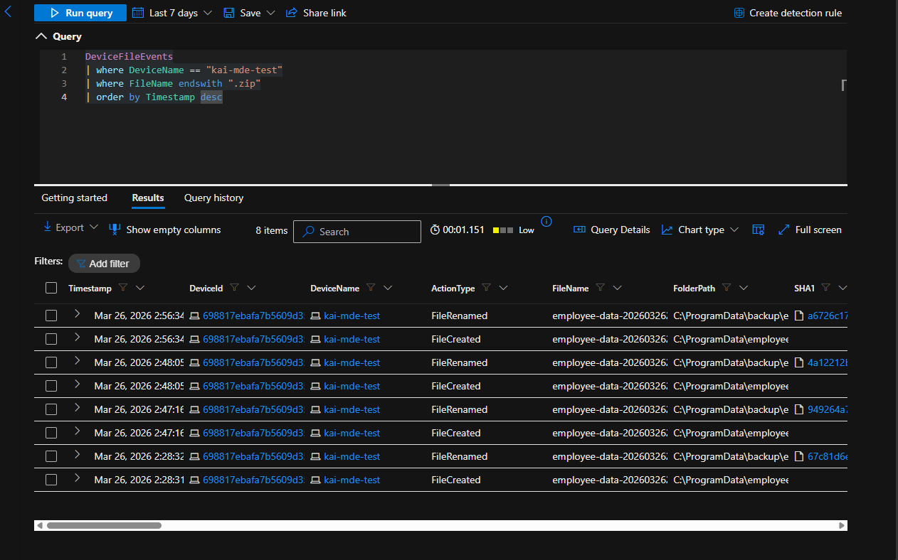
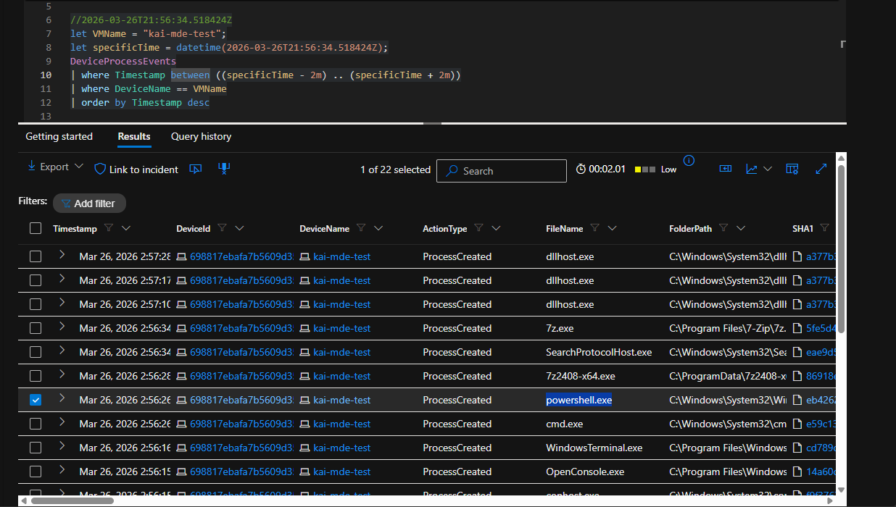
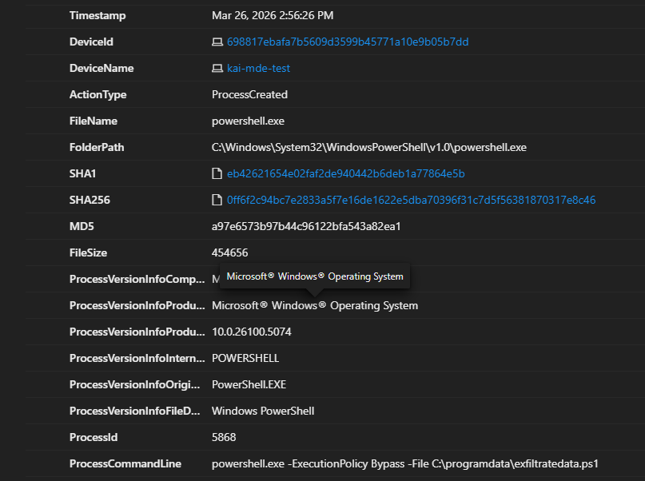
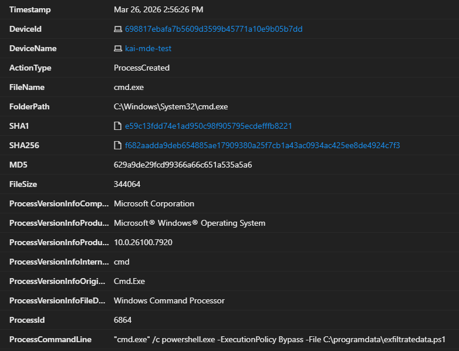
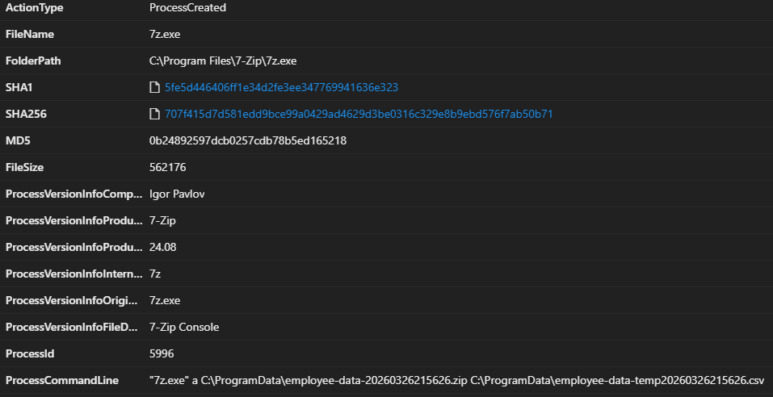
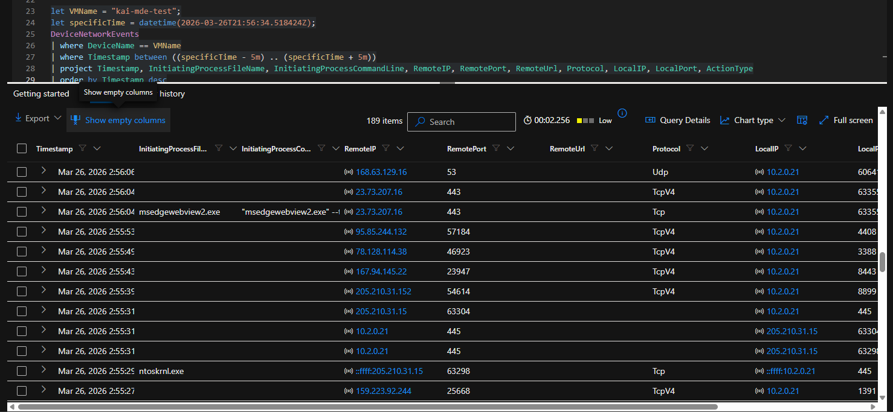

## Azure VM Data Staging Investigation — Suspected Insider Exfiltration (MDE)

### Environment & Scenario Context

An employee named John Doe, working in a sensitive department, had recently been placed on a performance improvement plan (PIP). Following concerning behavior, management raised the possibility that he might attempt to take proprietary company data before leaving the organization.

Using Microsoft Defender for Endpoint, an investigation was conducted on **kai-mde-test** to determine whether the device showed signs of suspicious scripting, archive creation, or outbound activity consistent with internal data staging or attempted exfiltration.

---

### Detection Approach

Given the insider threat concern, a hypothesis-driven hunt was performed focusing on behaviors commonly associated with internal data collection and staging.

Notes guiding the hunt:

- Creation of ZIP archives or compressed data files can indicate staging prior to exfiltration
- PowerShell or command-shell execution may be used to automate data collection and archiving
- Archive tooling such as 7-Zip can be abused to package sensitive files for removal
- Outbound network activity occurring near suspicious execution timelines may indicate attempted exfiltration

The goal was to determine whether data had been packaged for removal and whether available telemetry supported successful exfiltration.

**ATT&CK Techniques Observed:**

- **T1059.001 — Command and Scripting Interpreter: PowerShell**
- **T1560.001 — Archive Collected Data: Archive via Utility**
- **T1105 — Ingress Tool Transfer**

---

### Data Sources Reviewed

- `DeviceFileEvents` — archive creation, rename, and file movement activity
- `DeviceProcessEvents` — process execution, command-line analysis, and execution chain reconstruction
- `DeviceNetworkEvents` — outbound network activity review during the suspicious time window

---

### Archive Activity Analysis

```kusto
DeviceFileEvents
| where DeviceName == "kai-mde-test"
| where FileName endswith ".zip"
| order by Timestamp desc
```



Analysis of `DeviceFileEvents` revealed repeated ZIP-related activity on the host, including both `FileCreated` and `FileRenamed` events. Several of the files followed an `employee-data` naming pattern and appeared within `C:\ProgramData`, with some activity involving a backup-related directory.

**Findings:**

- Repeated ZIP archive creation occurred on the target system
- Multiple rename events suggested archived data was being staged or moved after creation
- File naming strongly suggested collection and packaging of employee-related data

---

### Process Activity Correlation

```kusto
let VMName = "kai-mde-test";
let specificTime = datetime(2026-03-26T21:56:34.518424Z);
DeviceProcessEvents
| where Timestamp between ((specificTime - 2m) .. (specificTime + 2m))
| where DeviceName == VMName
| order by Timestamp desc
```



After identifying suspicious archive activity, process events were reviewed around the same timestamp to determine what execution chain drove the file activity. This showed a sequence involving `cmd.exe`, `powershell.exe`, `7z2408-x64.exe`, and `7z.exe`, indicating that the archive activity was associated with scripted and command-line driven execution.

**Findings:**

- Command-shell activity occurred immediately before the archive creation events
- PowerShell execution was present in the same timeframe
- 7-Zip tooling was launched on the system and aligned with the ZIP activity
- The sequence was consistent with deliberate archive staging rather than routine background behavior

---

### PowerShell Execution Validation

```powershell
powershell.exe -ExecutionPolicy Bypass -File C:\programdata\exfiltratedata.ps1
```



Detailed review of the PowerShell process confirmed direct execution of a script named `exfiltratedata.ps1` using the `-ExecutionPolicy Bypass` flag.

**Findings:**

- PowerShell was used to run a suspicious script from `C:\ProgramData`
- The script name directly aligned with the exfiltration-focused scenario
- The use of `-ExecutionPolicy Bypass` indicated deliberate execution outside normal PowerShell policy controls

---

### Execution Chain Validation

```cmd
cmd.exe /c powershell.exe -ExecutionPolicy Bypass -File C:\programdata\exfiltratedata.ps1
```



Additional process inspection showed that the PowerShell execution was launched through `cmd.exe`, helping reconstruct the execution chain behind the suspicious activity.

**Findings:**

- `cmd.exe` was used to launch PowerShell
- The script execution was chained through the Windows command shell
- This linked the shell activity directly to the suspicious PowerShell behavior observed on the host

---

### Archive Creation Validation

```cmd
"7z.exe" a C:\ProgramData\employee-data-20260326215626.zip C:\ProgramData\employee-data-temp20260326215626.csv
```



Review of the 7-Zip process details provided direct command-line evidence that employee-related data was compressed into a ZIP archive on the host.

**Findings:**

- `7z.exe` created a ZIP archive from a CSV file
- The source file appeared to contain employee-related data
- The archive was created in `C:\ProgramData`
- The command line directly confirmed data packaging consistent with staging for possible exfiltration

---

### Network Activity Review

```kusto
let VMName = "kai-mde-test";
let specificTime = datetime(2026-03-26T21:56:34.518424Z);
DeviceNetworkEvents
| where DeviceName == VMName
| where Timestamp between ((specificTime - 5m) .. (specificTime + 5m))
| project Timestamp, InitiatingProcessFileName, InitiatingProcessCommandLine, RemoteIP, RemotePort, RemoteUrl, Protocol, LocalIP, LocalPort, ActionType
| order by Timestamp desc
```



Outbound network telemetry was reviewed during the same timeframe to determine whether the suspicious archive activity was followed by direct exfiltration behavior. While outbound connections were present, filtering did not show direct attribution to `powershell.exe`, `cmd.exe`, or `7z.exe`.

**Findings:**

- Outbound network activity occurred near the suspicious execution timeline
- No direct process-level correlation was confirmed for PowerShell, cmd, or 7-Zip
- Available network logs did not conclusively prove successful exfiltration

---

### Conclusion

The investigation confirmed suspicious script-driven archive activity on **kai-mde-test**. Microsoft Defender for Endpoint telemetry showed that `cmd.exe` launched PowerShell with `-ExecutionPolicy Bypass` to execute `exfiltratedata.ps1`, followed by `7z.exe` compressing an employee-related CSV file into a ZIP archive in `C:\ProgramData`.

These findings strongly supported the hypothesis that data was being staged for potential exfiltration. Although outbound network activity was reviewed during the same timeframe, the available `DeviceNetworkEvents` telemetry did not directly attribute those connections to the identified script and archive processes.

The activity was assessed as **confirmed internal data staging with no directly confirmed exfiltration from available network logs**.

---

### Recommended Mitigations & Improvements

- Remove unnecessary local administrative privileges from end users
- Restrict or monitor unauthorized archive utilities such as 7-Zip
- Enforce tighter PowerShell execution controls and logging
- Alert on suspicious archive creation in directories such as `C:\ProgramData`
- Increase monitoring for insider threat scenarios involving privileged users
- Improve timeline-based detections that correlate process, file, and network telemetry during suspected data staging events