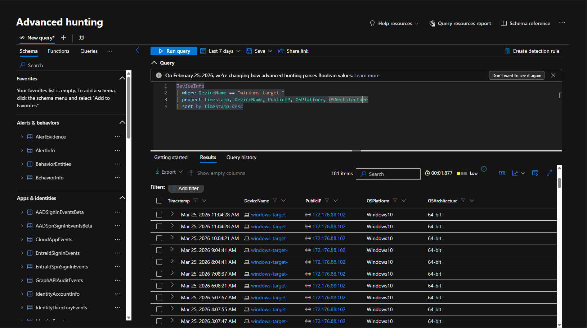
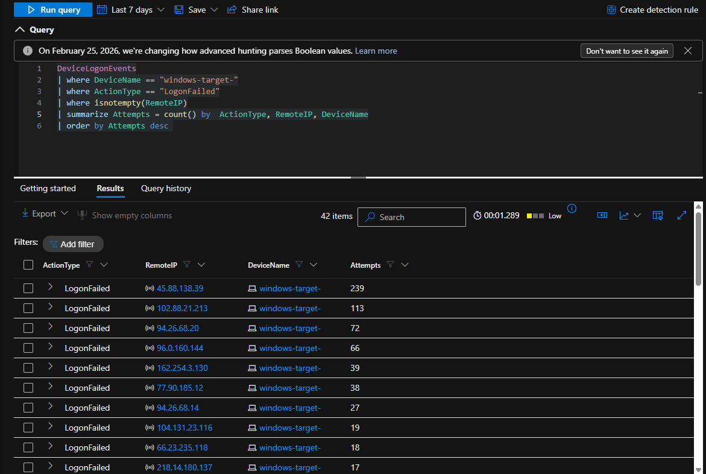
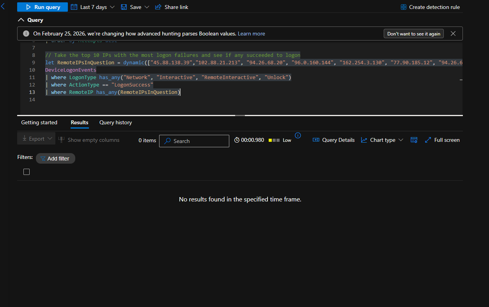
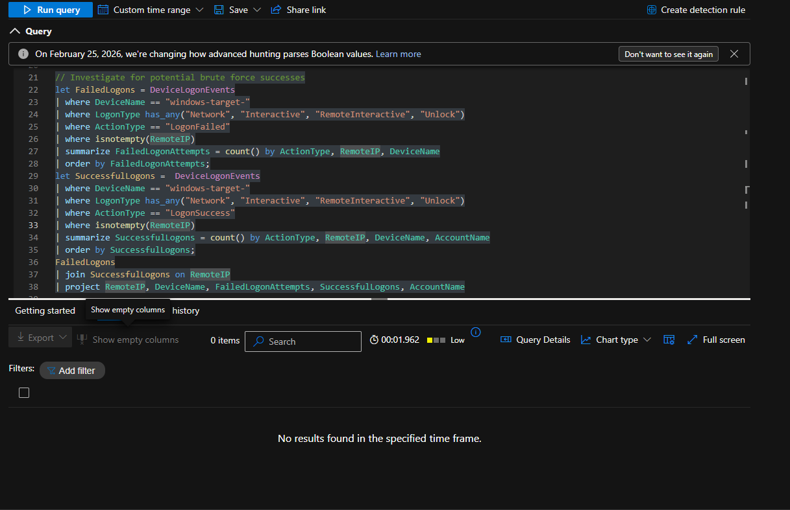

## Azure VM Exposure — Brute Force Investigation (MDE)

### Environment & Scenario Context

During routine security monitoring, a virtual machine within the shared services environment was identified as potentially exposed to the public internet. Due to the absence of account lockout controls, the system was considered susceptible to brute-force authentication attempts.

Using Microsoft Defender for Endpoint, a proactive threat hunt was conducted to determine whether external actors attempted authentication and whether any of that activity resulted in successful access.

---

### Detection Approach

Given the absence of a triggering alert, a hypothesis-driven approach was applied, focusing on authentication telemetry commonly associated with brute-force activity.

Notes guiding the hunt:

* Internet-exposed systems are frequently targeted by automated login attempts
* Brute-force behavior is characterized by repeated failed authentication attempts from external IPs
* Successful compromise typically appears as a transition from repeated failures to a successful logon

**ATT&CK Techniques Observed:**

* T1110 — Brute Force
* T1133 — External Remote Services

---

### Data Sources Reviewed

* `DeviceLogonEvents` — authentication attempts and logon activity
* `DeviceInfo` — device context and exposure validation

---

### Target Identification

```kusto
DeviceInfo
| where DeviceName == "windows-target-"
| project Timestamp, DeviceName, PublicIP, OSPlatform
| sort by Timestamp desc
```



Initial scoping confirmed the presence of the target system within Defender telemetry. The hostname appeared truncated as `windows-target-`, which was used consistently across subsequent queries.

---

### Failed Logon Activity Analysis

```kusto
DeviceLogonEvents
| where DeviceName == "windows-target-"
| where ActionType == "LogonFailed"
| where isnotempty(RemoteIP)
| summarize Attempts = count() by RemoteIP, DeviceName
| order by Attempts desc
```



Analysis of failed authentication activity revealed:

* Multiple external IP addresses generating repeated failed logon attempts
* High-frequency attempt patterns consistent with automated brute-force behavior
* No evidence of account lockout enforcement on the exposed system

---

### Authentication Outcome Validation

```kusto
let RemoteIPsInQuestion = dynamic(["45.88.138.39","102.88.21.213","94.26.68.20","96.0.160.144","162.254.3.130","77.90.185.12","94.26.68.14"]);

DeviceLogonEvents
| where LogonType has_any("Network", "Interactive", "RemoteInteractive", "Unlock")
| where ActionType == "LogonSuccess"
| where RemoteIP has_any(RemoteIPsInQuestion)
```



Validation against the highest-volume attacking source IPs showed:

* No successful authentication events tied to the identified brute-force sources
* No evidence that the observed external attacks resulted in unauthorized access
* The attempted brute-force activity was assessed as unsuccessful within the observed timeframe

---

### Correlation Analysis — Failed vs Successful Logons

```kusto
let FailedLogons = DeviceLogonEvents
| where DeviceName == "windows-target-"
| where ActionType == "LogonFailed"
| where isnotempty(RemoteIP)
| summarize FailedLogonAttempts = count() by RemoteIP, DeviceName;

let SuccessfulLogons = DeviceLogonEvents
| where DeviceName == "windows-target-"
| where ActionType == "LogonSuccess"
| where isnotempty(RemoteIP)
| summarize SuccessfulLogons = count() by RemoteIP, DeviceName, AccountName;

FailedLogons
| join SuccessfulLogons on RemoteIP
| project RemoteIP, DeviceName, FailedLogonAttempts, SuccessfulLogons, AccountName
```



Correlation analysis was performed to identify potential brute-force success patterns.

**Findings:**

* No overlap between failed and successful authentication activity on the target VM
* No evidence of a failed-to-successful logon sequence from remote sources
* No signs of brute-force success or follow-on compromise

---

### Conclusion

The investigation identified sustained brute-force authentication attempts originating from multiple external IP addresses against an exposed virtual machine.

Despite the volume and persistence of these attempts, no successful authentication events were observed from the identified attack sources, and no failed-to-success correlation was identified on the target system.

The activity was assessed as **unsuccessful brute-force activity with no confirmed system compromise**.

---

### Recommended Mitigations & Improvements

* Restrict public exposure of internal systems via NSG rules
* Implement account lockout policies
* Enforce multi-factor authentication (MFA)
* Limit remote access to trusted IP ranges or VPN
* Develop alerting for excessive failed authentication attempts
* Continuously monitor internet-exposed assets for unintended exposure
