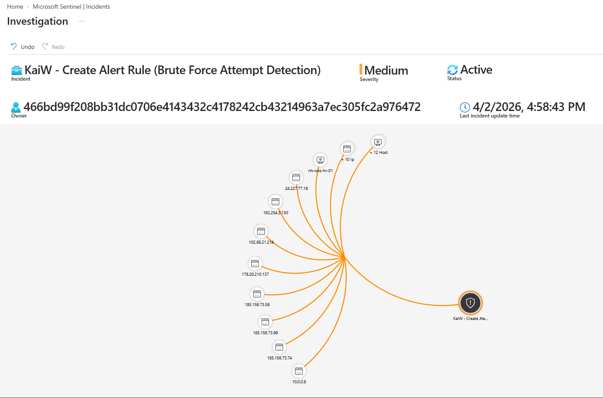
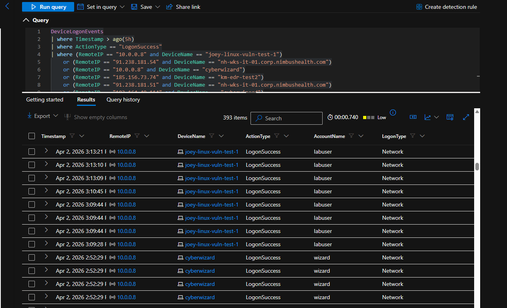
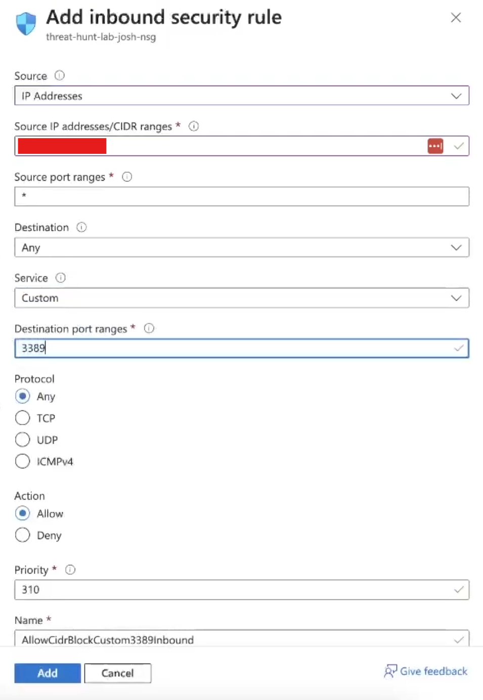
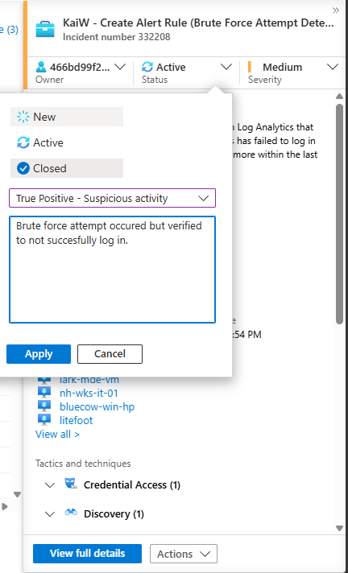

## Microsoft Sentinel Brute Force Attempt Detection & Incident Response

### Environment & Scenario Context

A Microsoft Sentinel scheduled analytics rule was created to detect repeated failed logon attempts from the same remote IP address against the same Azure-hosted system within a 5-hour period. The purpose of the lab was to simulate a brute-force detection workflow, generate an incident, investigate the alert within Sentinel, validate whether any of the observed activity resulted in successful authentication, and document the response using an incident-response mindset aligned to the NIST 800-61 lifecycle.

The rule logic was based on the `DeviceLogonEvents` table and was configured to trigger when the same `RemoteIP` failed to authenticate to the same `DeviceName` 10 or more times within the last 5 hours.

---

### Detection Approach

Given the goal of detecting likely brute-force behavior, the hunt and alerting logic focused on repeated failed authentication activity tied to the same source and same target.

Notes guiding the detection:

- Brute-force activity often appears as repeated failed logons from the same remote source
- Repeated failures against the same host can indicate focused authentication abuse
- Incident triage should validate whether failed attempts later transitioned into successful logons
- Containment in a real environment would normally include host isolation or access restriction

**ATT&CK Techniques Observed:**

- **T1110 — Brute Force**
- **T1133 — External Remote Services**

---

### Data Sources Reviewed

- `DeviceLogonEvents` — failed logon activity, successful logon validation, remote IP and device correlation
- Microsoft Sentinel Incident Graph — entity mapping across remote IPs and hosts
- NSG configuration in Azure — containment action to restrict inbound RDP exposure

---

### Analytics Rule Logic

```kusto
DeviceLogonEvents
| where ActionType == "LogonFailed" and TimeGenerated > ago(5h)
| summarize EventCount = count() by RemoteIP, DeviceName
| where EventCount >= 10
| order by EventCount
```

A Sentinel Scheduled Query Rule was created using this detection logic. The rule was configured to run every 4 hours, look back across the last 5 hours, automatically create an incident when triggered, and group all alerts into a single incident per 24-hour period.

**Findings:**

- The rule successfully identified repeated failed logon patterns consistent with brute-force behavior
- Remote IP and host entity mappings were generated for use in incident investigation
- Sentinel automatically created an incident based on the analytics rule output

---

### Incident Investigation

Once the rule triggered, the incident was assigned and set to **Active** for investigation. The Sentinel investigation graph showed multiple remote IP entities mapped across multiple hosts, which was consistent with broad brute-force style authentication activity rather than a single failed access event.



**Findings:**

- Multiple remote IP addresses were associated with repeated failed logon attempts
- Multiple hosts were represented in the investigation graph
- The incident was appropriate for triage as a true brute-force detection event

---

### Follow-up Authentication Validation

A follow-up query was executed to determine whether any of the flagged IP and host combinations later produced successful authentication events.

```kusto
DeviceLogonEvents
| where Timestamp > ago(5h)
| where ActionType == "LogonSuccess"
| where (RemoteIP == "10.0.0.8" and DeviceName == "joey-linux-vuln-test-1")
    or (RemoteIP == "91.238.181.54" and DeviceName == "nh-wks-it-01.corp.nimbushealth.com")
    or (RemoteIP == "10.0.0.8" and DeviceName == "cyberwizard")
    or (RemoteIP == "185.156.73.74" and DeviceName == "km-edr-test2")
    or (RemoteIP == "91.238.181.51" and DeviceName == "nh-wks-it-01.corp.nimbushealth.com")
    or (RemoteIP == "103.164.49.114" and DeviceName == "cyberwizard")
    or (RemoteIP == "141.98.11.59" and DeviceName == "nh-wks-bill-01.corp.nimbushealth.com")
    or (RemoteIP == "103.164.49.114" and DeviceName == "baobao-vm")
    or (RemoteIP == "141.98.83.66" and DeviceName == "nh-wks-clin-01.corp.nimbushealth.com")
    or (RemoteIP == "185.156.73.69" and DeviceName == "km-edr-test2")
    or (RemoteIP == "185.156.73.59" and DeviceName == "km-edr-test2")
    or (RemoteIP == "91.238.181.53" and DeviceName == "nh-wks-clin-01.corp.nimbushealth.com")
    or (RemoteIP == "91.238.181.55" and DeviceName == "nh-wks-clin-01.corp.nimbushealth.com")
    or (RemoteIP == "178.20.210.137" and DeviceName == "lark-mde-vm")
    or (RemoteIP == "102.88.21.214" and DeviceName == "nh-wks-bill-01.corp.nimbushealth.com")
    or (RemoteIP == "91.238.181.54" and DeviceName == "nh-wks-clin-01.corp.nimbushealth.com")
    or (RemoteIP == "91.238.181.51" and DeviceName == "nh-wks-bill-01.corp.nimbushealth.com")
    or (RemoteIP == "178.20.210.137" and DeviceName == "bluecow-win-hp")
    or (RemoteIP == "178.20.210.137" and DeviceName == "noah-vm-lab")
    or (RemoteIP == "71.184.116.177" and DeviceName == "litefoot")
    or (RemoteIP == "104.45.192.52" and DeviceName == "bluecow-win-hp")
    or (RemoteIP == "162.254.3.130" and DeviceName == "nh-wks-hr-01.corp.nimbushealth.com")
| project Timestamp, RemoteIP, DeviceName, ActionType, AccountName, LogonType
| order by Timestamp desc
```



Results showed that only a limited subset of the reviewed combinations returned `LogonSuccess` activity. Those successful events appeared tied to IPs that already had legitimate access to the corresponding systems, rather than clear evidence of successful brute-force compromise.

**Findings:**

- Successful logon events were not broadly observed across the flagged external IP/device combinations
- A small subset of combinations returned `LogonSuccess`, but those appeared consistent with existing legitimate access
- No clear evidence of successful unauthorized brute-force compromise was confirmed during the reviewed timeframe

---

### Containment Action

In a real-world environment, affected systems would typically be isolated through Microsoft Defender for Endpoint while the incident was actively investigated. Because this was a shared lab environment, endpoint isolation was not performed in order to avoid disrupting other cyber range users.

Instead, containment was simulated by updating the Network Security Group attached to the virtual machine to restrict inbound RDP access to my local public IP only. This prevented further public internet RDP attempts while preserving controlled administrative access for the lab.



**Findings:**

- RDP exposure was restricted at the network boundary
- Public internet access to the VM was reduced as a containment step
- NSG hardening provided a practical lab-safe alternative to endpoint isolation

---

### Incident Closure

After investigation and validation, the incident was closed in Sentinel as a **True Positive - Suspicious activity**. The closure notes documented that brute-force behavior was confirmed, but successful unauthorized logon was not verified from the available telemetry.



**Findings:**

- The incident was worked through assignment, investigation, validation, containment, and closure
- The final disposition accurately reflected confirmed brute-force activity without confirmed compromise
- Closure aligned with a realistic incident response workflow

---

### Conclusion

This lab demonstrated how Microsoft Sentinel can be used to detect, investigate, and close a brute-force related incident using scheduled analytics rules, entity mapping, and follow-up log validation. The detection logic successfully identified repeated failed authentication attempts from the same remote IP against the same host and automatically generated an incident for triage.

Follow-up validation showed that while a small number of flagged IP and host combinations had successful logon events, those appeared tied to entities with legitimate access rather than clear evidence of successful brute-force compromise. Based on the available telemetry, the incident was assessed as a **true positive brute-force attempt with no confirmed unauthorized access**.

---

### Recommended Mitigations & Improvements

- Restrict public RDP exposure wherever possible
- Require tighter NSG rules for all internet-facing virtual machines
- Consider enforcing VM access restrictions broadly through Azure Policy
- Include successful logon validation as a standard step in brute-force incident triage
- Use Sentinel incident notes and closure reasons consistently to improve investigation quality and reporting